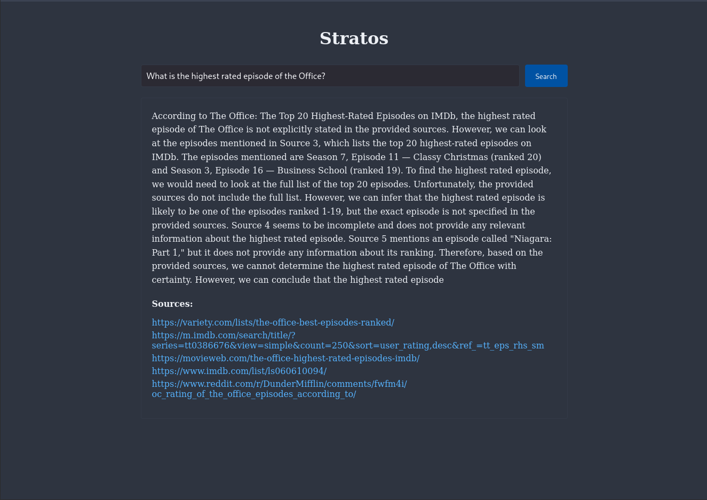

# Stratos

A modern search engine implementation using Retrieval-Augmented Generation (RAG) with Google Search API integration.

## 🎥 Demo


[Click here to watch the demo](./demo.mp4)

> This will download or open the demo video depending on your browser settings.

## 🚀 Features

- Real-time web search using Google Search API
- Advanced text processing with T5 model
- Vector-based retrieval system using BERT embeddings
- Modern React TypeScript frontend
- FastAPI backend with async support
- Modular and extensible architecture

## 🛠️ Technology Stack

### Backend
- FastAPI
- LangChain
- Transformers (BERT, T5)
- FAISS Vector Store
- Google Search API

### Frontend
- React 18
- TypeScript
- Material-UI
- Vite

## 📋 Prerequisites

- Python 3.8+
- Node.js 16+
- Google Search API credentials
- GPU (optional, but recommended)

## 🔧 Installation

1. **Clone the repository**
    ```bash
    git clone https://github.com/junkim100/Stratos.git
    cd Stratos
    ```

2. **Set up backend**
    ```bash
    # Create and activate conda environment
    conda create -n Stratos python==3.10.0 -y
    conda activate Stratos

    # Install dependencies
    pip install -r requirements.txt
    ```

3. **Environment Setup**
    Create a `.env` file in the root directory:
    ```bash
    # Copy environment template
    cp .env.example .env

    # Copy configuration template
    cp config.example.yml config.yml
    ```
    Edit `.env` with your Google API credentials:
    ```env
    GOOGLE_CSE_ID=your_cse_id
    GOOGLE_API_KEY=your_api_key
    ```

4. **Configuration**
    Create a `config.yml` file in the root directory:
    ```yaml
    # Model Settings
    model:
      generation:
        name: "arcee-ai/Llama-3.1-SuperNova-Lite"
        parameters:
          max_length: 512
          min_length: 50
          num_beams: 4
          temperature: 0.7
          do_sample: true
          top_p: 0.9
          top_k: 50
        device:
          dtype: "float16"
          map: "auto"

    # Chunk Settings
    chunks:
      size: 500
      overlap: 50

    # Processing Settings
    processing:
      max_chunks: 5
      min_chunk_length: 50
      max_summary_length: 150
    ```

5. **Set up frontend**
    ```bash
    # Install dependencies for the frontend (from within the frontend directory)
    npm install
    ```

## ⚙️ Configuration Options

### Model Settings

| Parameter       | Description                                    |
|-----------------|------------------------------------------------|
| `name`          | The HuggingFace model identifier               |
| `max_length`    | Maximum length of generated text               |
| `min_length`    | Minimum length of generated text               |
| `num_beams`     | Number of beams for beam search                |
| `temperature`   | Sampling temperature (higher = more random)    |
| `do_sample`     | Whether to use sampling                        |
| `top_p`         | Nucleus sampling parameter                     |
| `top_k`         | Top-k sampling parameter                       |
| `dtype`         | Data type for model weights                    |
| `map`           | Device mapping strategy                        |

### Chunk Settings

| Parameter   | Description                    |
|-------------|--------------------------------|
| `size`      | Size of text chunks for processing |
| `overlap`   | Overlap between consecutive chunks |

### Processing Settings

| Parameter           | Description                             |
|---------------------|-----------------------------------------|
| `max_chunks`        | Maximum number of chunks to process     |
| `min_chunk_length`  | Minimum length for valid chunks         |
| `max_summary_length`| Maximum length of chunk summaries       |

## 🚀 Running the Application

1. **Start the backend server**
   ```bash
   uvicorn backend.api.endpoints:app --reload --host 0.0.0.0 --port 51441 
  ```

2. **Start the frontend development server**
  ```bash
  npm run dev -- --host 0.0.0.0 --port 51440 
  ```

3. **Access the application**
  Navigate to http://localhost:51440 in your browser.

  ## 🏗️ Project Structure
  ```
  Stratos/
  ├── backend/
  │   ├── __init__.py
  │   ├── api/
  │   │   ├── __init__.py
  │   │   ├── endpoints.py        # FastAPI endpoints and routes 
  │   ├── config/
  │   │   ├── __init__.py         # Configuration loader 
  │   │   └── settings.py         # YAML and dotenv settings management 
  │   ├── core/
  │   │   ├── __init__.py         
  │   │   ├── generator.py        # LLM generation logic 
  │   │   ├── processor.py        # Text processing logic 
  │   │   └── retriever.py        # Google Search API integration and retrieval logic 
  │   ├── models/
  │   │   ├── __init__.py         
  │   │   └── schema.py           # Pydantic models for request/response validation 
  ├── frontend/
  │   ├── index.html              # Main HTML file for React app 
  │   ├── public/                 # Static assets 
  │   │   └── favicon.ico         
  │   ├── src/                    # React source files 
  │   │   ├── api/                # API service files for interacting with backend 
  │   │   │   └── search.ts       
  │   │   ├── components/         # Reusable UI components (SearchBar, ResultCard) 
  │   │   └── styles/             # CSS stylesheets for components 
  ├── .env                        # Environment variables for sensitive data (Google API keys)
  ├── config.yml                  # YAML configuration file for model and processing settings 
  └── requirements.txt            # Backend Python dependencies 
  ```

## 🛠️ API Endpoints
  Search Endpoint
    - URL: /api/search
    - Method: POST Body:
    ```json
    {
        "query": "Your search query here"
    }
    ```
    - Response:
    ```json
    {
        "answer": "Generated response",
        "sources": ["url1", "url2"]
    }
    ```

## 🧪 Testing

  1. **Run backend tests**
  ```bash
    pytest backend/tests/
  ```

  2. **Run frontend tests**

  ```bash
  npm test frontend/src/
  ```

## 📈 Performance Optimization

    Uses FAISS for efficient vector similarity search.
    Implements caching for frequent queries.
    Optimized chunk size for context processing.
    Parallel processing for multiple search results.

## 🤝 Contributing

    Fork the repository.
    Create your feature branch (git checkout -b feature/AmazingFeature).
    Commit your changes (git commit -m 'Add some AmazingFeature').
    Push to the branch (git push origin feature/AmazingFeature).
    Open a Pull Request.

## 📝 License
This project is licensed under the MIT License - see the LICENSE file for details.

## 👥 Authors
- [Dongjun Kim](https://github.com/junkim100)
